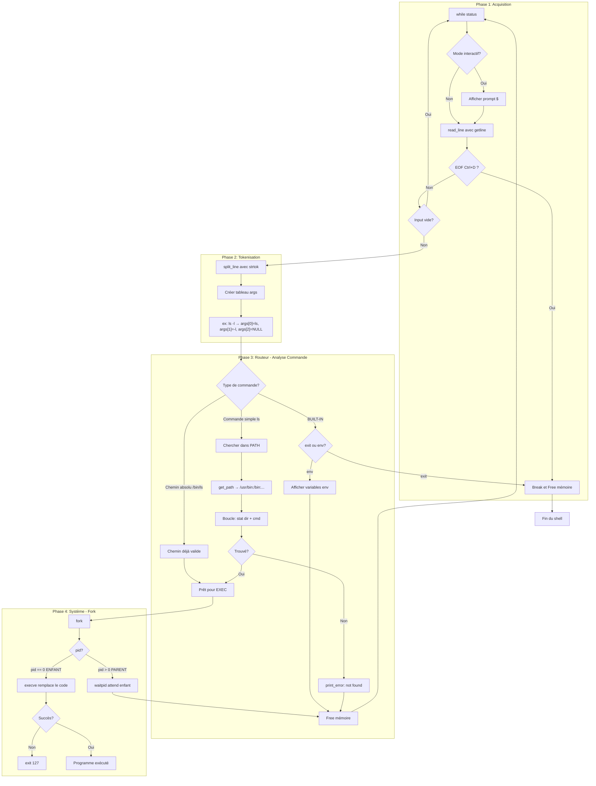

# Simple Shell

A simple UNIX command line interpreter written in C for Holberton School.

## Description

This project is a basic implementation of a shell that replicates the behavior of `/bin/sh`. It supports both interactive and non-interactive modes.

## Compilation

```bash
gcc -Wall -Werror -Wextra -pedantic -std=gnu89 *.c -o hsh
```

## Usage

### Interactive Mode

```bash
$ ./hsh
$ ls -la
$ pwd
$ env
$ exit
```

### Non-Interactive Mode

```bash
$ echo "ls -la" | ./hsh
$ cat commands.txt | ./hsh
```

## Features

- Display a prompt and wait for user input
- Execute commands with arguments
- Handle the PATH environment variable
- Built-in commands: `exit`, `env`
- Handle EOF (Ctrl+D)
- Error handling matching `/bin/sh` behavior

## Flowchart



## Files

| File | Description |
|------|-------------|
| `shell.h` | Header file with prototypes and includes |
| `main.c` | Entry point and main shell loop |
| `input.c` | Input reading and parsing functions |
| `executor.c` | Command execution using fork/execve |
| `path.c` | PATH resolution and command search |
| `builtins.c` | Built-in commands (exit, env) |
| `helpers.c` | Helper functions for error handling |
| `string_utils.c` | String manipulation utilities |

## Built-in Commands

| Command | Description |
|---------|-------------|
| `exit` | Exit the shell |
| `env` | Print the current environment |

## Examples

```bash
$ ./hsh
$ /bin/ls
file1.c  file2.c  shell.h  main.c
$ ls -l
total 32
-rw-r--r-- 1 user user 1234 Jan  4 file1.c
$ echo hello world
hello world
$ exit
$
```

## Error Handling

Errors are displayed in the format:
```
./hsh: <line_number>: <command>: not found
```

Example:
```bash
$ ./hsh
$ qwerty
./hsh: 1: qwerty: not found
$
```

## License

This project is part of the Holberton School curriculum.
