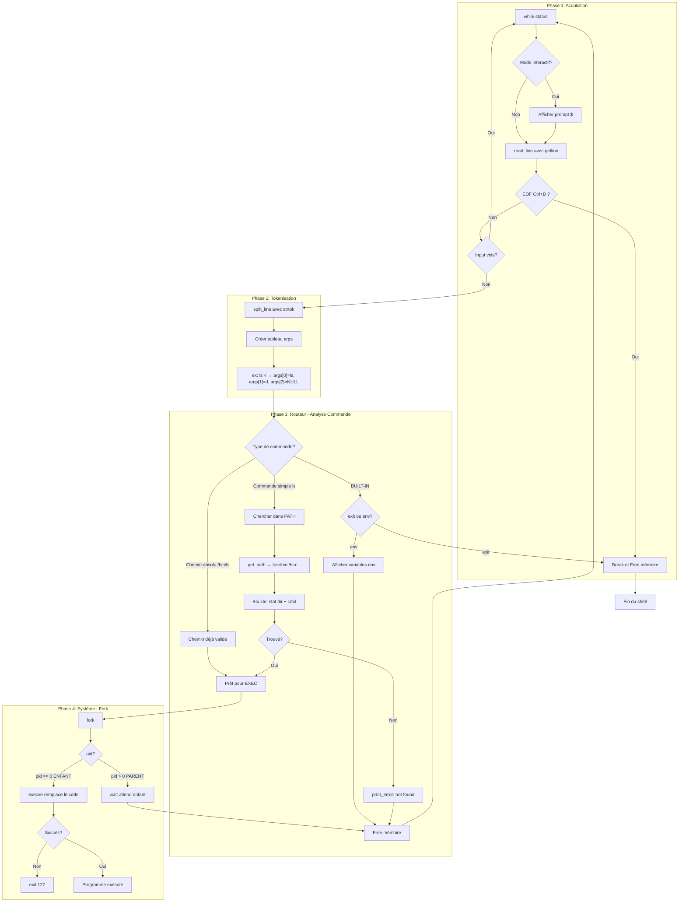

# Simple Shell

> A simple UNIX command line interpreter written in C for Holberton School.

[](https://en.wikipedia.org/wiki/C_(programming_language))
[](https://www.holbertonschool.fr/)

## 🔧 Technologies Used


## Description

This project is a custom UNIX command-line interpreter built as part of the Holberton School curriculum. The shell replicates the core behavior of `/bin/sh`, allowing users to execute commands, manage processes, and interact with the operating system through a simple prompt.

It supports both interactive mode (typing commands directly) and non-interactive mode (piping commands from files or other programs). Built entirely in C, this project demonstrates fundamental concepts of system programming including process creation, program execution, and environment management.

---

## 📦 Installation & Usage

### Getting Started with Simple Shell

Ready to explore? Follow these steps to get the shell running on your machine!

### Clone the Repository

```bash
git clone https://github.com/victormonnot/holbertonschool-simple_shell.git
cd holbertonschool-simple_shell
```

### Compile the Project

```bash
gcc -Wall -Werror -Wextra -pedantic -std=gnu89 *.c -o hsh
```

**What do these flags do?**

| Flag | Purpose |
|------|---------|
| `-Wall` | Enable all common warnings |
| `-Werror` | Treat warnings as errors |
| `-Wextra` | Enable extra warnings |
| `-pedantic` | Strict ISO C compliance |
| `-std=gnu89` | Use GNU C89 standard |

✅ This ensures the code is clean, bug-free, and follows C89 coding standards!

### Launch the Shell

```bash
./hsh
```

### 🎉 Ready to Explore!

Try running some basic commands:

```bash
$ ls
$ pwd
$ env
$ exit
```

Use `Ctrl + D` to exit the shell gracefully.

---

## Features

- Display a prompt and wait for user input
- Execute commands with arguments
- Handle the PATH environment variable
- Built-in commands: `exit`, `env`
- Handle EOF (Ctrl+D)
- Error handling matching `/bin/sh` behavior

---

## Flowchart



---

## 📁 Files

| File | Description |
|------|-------------|
| `shell.h` | Header file with prototypes and includes |
| `main.c` | Entry point and main shell loop |
| `input.c` | Input reading and parsing functions |
| `executor.c` | Command execution using fork/execve |
| `path.c` | PATH resolution and command search |
| `builtins.c` | Built-in commands (exit, env) |
| `helpers.c` | Helper functions for error handling |
| `string_utils.c` | String manipulation utilities |

---

## Built-in Commands

| Command | Description |
|---------|-------------|
| `exit` | Exit the shell |
| `env` | Print the current environment |

---

## Examples

```bash
$ ./hsh
$ /bin/ls
builtins.c  executor.c  helpers.c  input.c  main.c  path.c  shell.h  string_utils.c
$ ls -l
total 32
-rw-r--r-- 1 user user 1234 Jan  5 file1.c
$ echo hello world
hello world
$ exit
$
```

---

## Error Handling

Errors are displayed in the format:
```
./hsh: <line_number>: <command>: not found
```

Example:
```bash
$ ./hsh
$ qwerty
./hsh: 1: qwerty: not found
$
```

---
## License

This project is part of the Holberton School curriculum.

---

## Authors

This project was created by students at Holberton School. See the [AUTHORS](AUTHORS) file for the full list of contributors and contact email addresses.

---

<p align="center">
  Made by <a href="https://github.com/panmusic"><b>Panaki</b></a> & <a href="https://github.com/victormonnot"><b>Victor</b></a>
</p>
